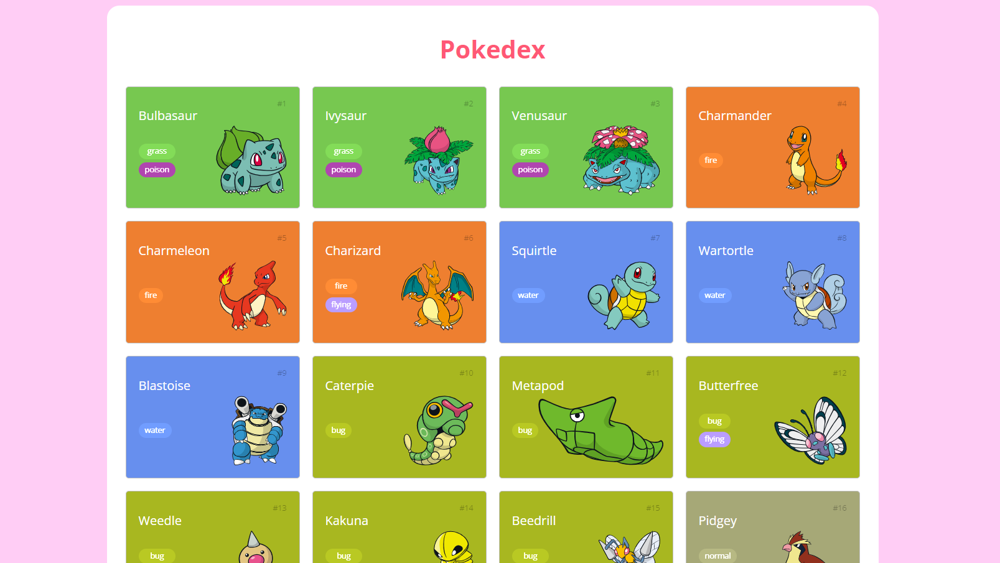

# Trilha JS Developer - Pokedex
Finalização do projeto Pokedex como parte do desafio '
Construindo uma Pokédex com JavaScript' do 'Santander Bootcamp 2023 - Fullstack Java+Angular'. 

Foram realizados alguns ajustes de layout e a inserção da funcionalidade de clicar em um Pokemon e abrir um modal com as suas principais características.

### Página principal:
 

### Modal com as principais características do Pokemon clicado:
  